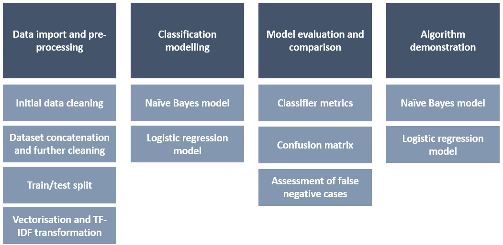

# SMS Spam Detection

**Author**: [Arina Ridha](https://www.linkedin.com/in/arina-ridha)

## Overview 
Natural Language Processing was utilised to build an SMS spam detector. Generative (Naive Bayes) and discriminative (logistic regression) binary classification models were trained on the same dataset of spam and legitimate (i.e., 'ham') text messages. The Naive Bayes model featured overall better performance. Future evaluation across other classification algorithms, updating the training dataset with increasingly sophisticated scam attempts and the incorporation of input beyond the language of text messages may further improve model performance.

## Business problem
__[A recent report compiled by the Australian Competition & Consumer Commission (ACCC)](https://www.accc.gov.au/media-release/accc-calls-for-united-front-as-scammers-steal-over-3bn-from-australians)__ notes how Australians have lost a total of $3.1 billion to scams in 2022 - an 80% jump in losses compared to numbers reported the year prior. SMS/text messages appeared to be the communication mode of choice for scammers.

Natural language processing (NLP) is a computational approach in analysing natural human speech. It has seen various applications, from summarising documents to answering text-based questions. NLP models are also commonly used to tackle the spam detection problem. 

The current project aims to detect and distinguish between spam and legitimate (i.e., 'ham') text messages by utilising the __[Bag of Words (BoW)](https://machinelearningmastery.com/gentle-introduction-bag-words-model/)__ and __[Term Frequency-Inverse Document Frequency (TF-IDF)](https://monkeylearn.com/blog/what-is-tf-idf/)__ techniques. The spam detector will be built using __[Naive Bayes and Logistic Regression](https://dataespresso.com/en/2017/10/24/comparison-between-naive-bayes-and-logistic-regression/)__ - two of the more popular classifiers in machine learning - and performance between models will be compared.

## Data sources

Both the Naive Bayes and Logistic Regression classifiers were built using information from the following datasets: 

- **SMS Spam Collection** (`spam.csv`), compiled by __[Tiago Almeida and Jos Hidalgo](https://archive.ics.uci.edu/dataset/228/sms+spam+collection)__ from the University of California, Irvine. The dataset contains 5572 texts, of which 13% are spam
- **SMS Phishing Dataset** (`Dataset_5971.csv`), compiled by __[Sandhya Mishra and Devpriya Soni](https://data.mendeley.com/datasets/f45bkkt8pr/1)__ from the Jaypee Institute of Information Technology. The dataset contains 5971 texts, of which 13% are spam/smishing (i.e., __[SMS-phishing](https://www.google.com/search?q=what+is+smishing&rlz=1C1GCEA_enAU1065AU1065&oq=what+is+smishing&gs_lcrp=EgZjaHJvbWUyBggAEEUYOTIGCAEQRRhAMgkIAhAjGCcYigUyCQgDECMYJxiKBTIJCAQQABhDGIoFMgkIBRAAGEMYigUyCQgGEAAYQxiKBTIJCAcQABhDGIoF0gEIMTQ3OWowajeoAgCwAgA&sourceid=chrome&ie=UTF-8)__)

## Process summary

## Methods

Please see [sms_spam_detector.ipynb](https://github.com/arinargh/sms-spam-detector/blob/main/sms_spam_detector.ipynb) for the full methodology.

## Conclusion

1. **The Naive Bayes model showed perfect precision with regards to spam**, although it's definitely also worth noting that the logistic regression model's precision rate is nowhere near poor. In other words, if the algorithms marks a message as spam, the likelihood of that message actually being spam is very high.
2. "**The Naive Bayes model was more sensitive to spam, relative to the logistic regression model**. This indicates that the Naive Bayes model presents a lower risk of misclassifying spam texts as legitimate ones. 
3. **Introducing a third classification category - "Potential spam" - may be helpful in flagging malicious messages that would have otherwise been false negatives**. The content of these messages can then be manually reviewed and verified before any further action is taken.

## Next steps

1. **Comparing model performance across __[other classification algorithms](https://au.mathworks.com/campaigns/offers/next/choosing-the-best-machine-learning-classification-model-and-avoiding-overfitting.html)__ beyond Naive Bayes and logistic regression**, e.g., k-nearest neighbours and support vector machines.
2. **Training the model on a richer dataset across different languages**. Data on the most __[current and increasingly sophisticated](https://www.scamwatch.gov.au/news-alerts/browse-news-alerts?f%5B0%5D=scam_category%3A29)__ phishing attempts would be invaluable.
3. **Further improving the algorithm's performance by incorporating input beyond the language-based contents of an SMS**. For instance, __[myGov Australia never sends an SMS with a link](https://www.servicesaustralia.gov.au/active-scams?context=60271#:~:text=These%20are%20all%20scams.,a%20new%20myGov%20Inbox%20message)__. Messages claiming to be from myGov can be screened for such links to better capture otherwise legitimate-sounding scams. Blacklisted phone numbers may also be taken into account by the model.

